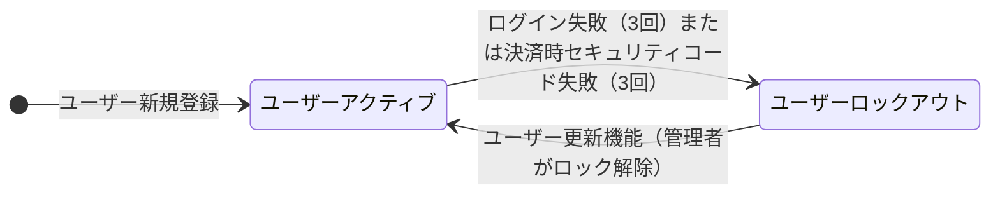
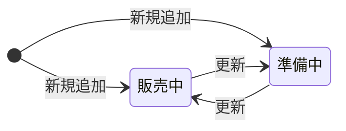
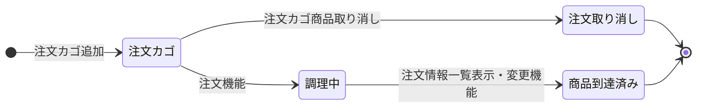
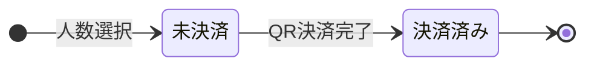
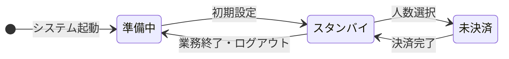

# ステートチャート図

## 改版履歴
| 日付 | メンバー | バージョン | 概要 |
| :--- | :--- | :--- | :--- |
| 2025/12/10 | 蓬莱、星野、小野田 | 1.0 | 初版作成 |
### 1. ユーザー状況

```mermaid
stateDiagram-v2
    direction LR

    [*] --> ユーザーアクティブ: ユーザー新規登録

    ユーザーアクティブ --> ユーザーロックアウト: ログイン失敗（3回）または決済時セキュリティコード失敗（3回）
    
    ユーザーロックアウト --> ユーザーアクティブ: ユーザー更新機能（管理者がロック解除）

```
### 2. 商品ステータス

```mermaid
stateDiagram-v2
    direction LR
    [*] --> 販売中: 新規追加
    [*] --> 準備中: 新規追加
    
    販売中 --> 準備中: 更新
    準備中 --> 販売中: 更新
```
### 3. 注文商品状況

```mermaid
stateDiagram-v2
    direction LR

    [*] --> 注文カゴ: 注文カゴ追加
    

    注文カゴ --> 注文取り消し: 注文カゴ商品取り消し
    注文カゴ --> 調理中: 注文機能
    
    調理中 --> 商品到達済み: 注文情報一覧表示・変更機能
    
    注文取り消し --> [*]
    商品到達済み --> [*]

```

### 4. 注文状況

```mermaid
stateDiagram-v2
    direction LR

    [*] --> 未決済: 人数選択
    
    未決済 --> 決済済み: QR決済完了
    
    決済済み --> [*]
```

### 5. テーブル状況

```mermaid
stateDiagram-v2
    direction LR
    
    [*] --> 準備中: システム起動
    準備中 --> スタンバイ: 初期設定
    
    スタンバイ --> 準備中: 業務終了・ログアウト
    スタンバイ --> 未決済: 人数選択
    
    未決済 --> スタンバイ: 決済完了
    
```